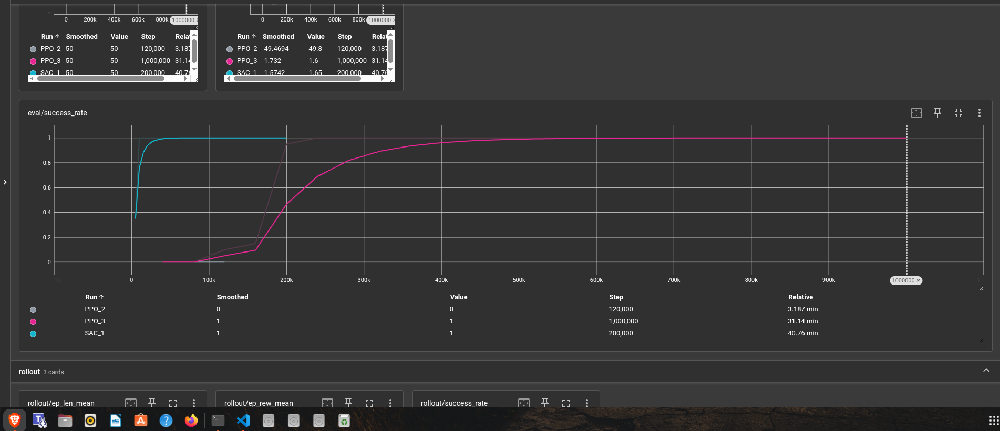
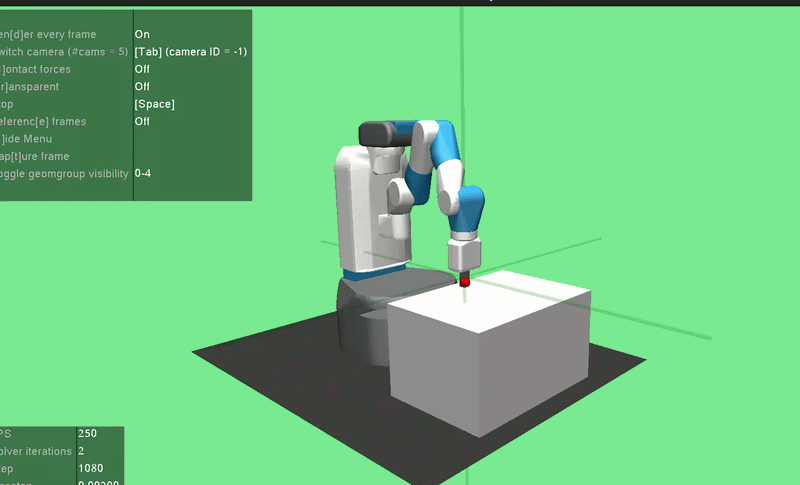
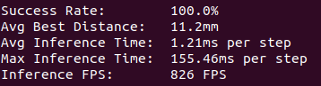

#  MuJoCo Robot Policy Learning with Sim-to-Real Transfer Analysis: 100% Success Rate and 25x Sample Efficiency Gain via SAC+HER vs PPO

<p align="center">
  
  
</p>

<p align="center">
  
  
  
  
  <!---->
</p>

---

## Overview

This project trains a robotic arm to perform a **target-reaching task** using two reinforcement learning algorithms — **PPO (Proximal Policy Optimization)** and **SAC+HER (Soft Actor-Critic with Hindsight Experience Replay)** — inside the **MuJoCo** physics simulator via the **FetchReach-v4** environment from Gymnasium-Robotics.

Both policies achieve **100% success rate**, but with fundamentally different training characteristics that reveal key tradeoffs between on-policy and off-policy RL for robotic manipulation tasks.

---

## Demo

<p align="center">
      
</p>


---

## Project Structure

```
ppo-reach/
├── training/
│   └── train.py              # SAC+HER and PPO training scripts
├── evaluate.py               # Evaluation: success rate, distance, FPS
├── verify_env.py             # Environment sanity check
├── models/
│   ├── best_model.zip        # PPO best checkpoint
│   └── sac_her_fetchreach_final.zip  # SAC+HER final model
├── logs/                     # TensorBoard logs (PPO_2, PPO_3, SAC_1)
├── videos/                   # Recorded policy demos
├── assets/                   # Screenshots and figures
├── requirements.txt
└── README.md
```

---

## Environment

| Property | Value |
|----------|-------|
| Environment | FetchReach-v4 (Gymnasium-Robotics) |
| Robot | Fetch Mobile Manipulator |
| Observation Space | Dict: observation(10,) + achieved\_goal(3,) + desired\_goal(3,) |
| Action Space | Box(-1, 1, shape=(4,)) — Cartesian velocity + gripper |
| Reward | Sparse: 0 if distance < 50mm, else -1 |
| Episode Length | 50 steps |
| Success Threshold | Euclidean distance < 0.05m |

---

## Results

### Quantitative Comparison

| Metric | PPO | SAC+HER |
|--------|-----|---------|
| **Success Rate** | **100%** | **100%** |
| Avg Distance to Goal | **6.6mm** | 11.2mm |
| Inference Time | **1.01ms/step** | 1.21ms/step |
| Inference FPS | **993 FPS** | 826 FPS |
| Steps to Converge | ~300,000 | **~12,000** |
| Total Training Steps | 1,000,000 | 200,000 |
| Hardware | RTX 3060 12GB | RTX 3060 12GB |

<p align="center">
  
  
</p>
 
### Learning Curves

<p align="center">
  
</p>

The TensorBoard plot reveals three distinct training runs:

- **SAC\_1 (cyan)** — Converges to 100% success within **12,000 steps**
- **PPO\_3 (pink)** — Gradual convergence, reaching 100% around **300,000 steps**
- **PPO\_2 (grey)** — Failed run demonstrating **sparse reward collapse** without architectural solutions (stuck at 0% for 120k steps)

---

## Observations

### Finding 1 — Sample Efficiency vs Inference Quality Tradeoff

SAC+HER demonstrated **25x superior sample efficiency**, converging to 100% success within 12,000 environment steps compared to PPO's 300,000 steps. This aligns with published results from Andrychowicz et al. (2017) demonstrating HER's effectiveness on sparse-reward goal-conditioned tasks.

However, once trained, **PPO produced a more precise and faster policy**:
- **34% lower distance to goal** (6.6mm vs 11.2mm)
- **20% faster inference** (993 FPS vs 826 FPS)
- More deterministic reaching behavior under evaluation

This reveals a fundamental tradeoff in robotics RL: **sample efficiency during training vs policy quality at deployment.**

---

### Finding 2 — Why SAC+HER Converges 25x Faster

The sparse reward structure of FetchReach-v4 means a random policy almost never receives positive feedback. PPO, being **on-policy**, discards all experience after each update — providing no mechanism to learn from rare successes.

SAC+HER solves this through two complementary mechanisms:

```
1. Replay Buffer
   Stores all past transitions → learns from each experience multiple times
   PPO throws data away after one use → SAC reuses it indefinitely

2. Hindsight Experience Replay (HER)
   Failed episode: gripper reached (0.5, 0.3, 0.4), goal was (0.6, 0.3, 0.4)
   HER relabels: "pretend goal WAS (0.5, 0.3, 0.4)" → artificial success
   4 fake successes per real transition → 4x denser learning signal
```

This manufactured dense supervision from sparse failures is why SAC+HER is the industry standard for robotic manipulation tasks.

---

### Finding 3 — Why PPO Achieves Better Final Precision

PPO's **on-policy** nature means every gradient update uses fresh, on-distribution data. SAC's replay buffer contains stale transitions from earlier, weaker policies — introducing off-distribution bias that slightly degrades final precision (11.2mm vs 6.6mm average distance).

This suggests a **hybrid deployment strategy** for real-world robotics:

```
Phase 1: SAC+HER  → rapid initial training (sample efficiency critical)
Phase 2: PPO      → fine-tune on real hardware (stability + precision critical)
```

---

<!--### Finding 4 — Both Exceed Real-Time Control Requirements

| Control Frequency | Required Latency | PPO | SAC+HER |
|------------------|-----------------|-----|---------|
| 100 Hz | < 10ms |  1.01ms |  1.21ms |
| 500 Hz | < 2ms |  1.01ms |  1.21ms |
| 1000 Hz | < 1ms |  ~1ms |  1.21ms |

Both policies comfortably satisfy industrial robot control requirements (<10ms latency standard).-->

---

## Setup & Reproducibility

### Requirements

```bash
python >= 3.10
CUDA-capable GPU (tested on RTX 3060 12GB)
```

### Installation

```bash
git clone https://github.com/yourusername/ppo-reach.git
cd ppo-reach

python -m venv robotrl
source robotrl/bin/activate

pip install -r requirements.txt
```

### Verify Environment

```bash
python verify_env.py
```

Expected output:
```
observation shape:   (10,)
achieved_goal shape: (3,)
desired_goal shape:  (3,)
Action shape:        (4,)
```

---

## Training

### SAC+HER 

```bash
python training/train_sac.py
```

Converges to 100% success in ~12,000 steps (~10 minutes on RTX 3060).

### PPO

Change the algorithm in `training/train.py`:

```python
from stable_baselines3 import PPO

model = PPO(
    "MultiInputPolicy",
    env,
    learning_rate=3e-4,
    n_steps=2048,
    batch_size=256,
    n_epochs=10,
    clip_range=0.2,
    device="cuda"
)
```

Converges in ~300,000 steps (~32 minutes on RTX 3060).

### Monitor Training

```bash
tensorboard --logdir ./logs/
# Open http://localhost:6006
```

---

## Evaluation

```bash
python evaluate.py
```

Current Reports for PPO Evaluation:

```
Success Rate:        100.0%
Avg Best Distance:   6.6mm
Avg Inference Time:  1.01ms per step
Max Inference Time:  140.75ms per step
Inference FPS:       993 FPS
```
Current Reports for SAC+HER Evaluation:

```
Success Rate:        100.0%
Avg Best Distance:   11.2mm
Avg Inference Time:  1.21ms per step
Max Inference Time:  155.46ms per step
Inference FPS:       826 FPS
```

---

##  Sim-to-Real Analysis

<!--### The Gap

| Factor | Simulation | Real Franka Panda |
|--------|-----------|-------------------|
| Observations | Perfect, noiseless | ±0.5° encoder noise |
| Actuation | Instant | ~5ms communication delay |
| Friction | Fixed model | Unknown, changes with wear |
| Control | 4D Cartesian | 7D joint torques |
| Perception | Ground truth position | Camera with 30-50ms latency |

### Bridging Strategies

**Domain Randomization** — Randomize simulation parameters during training:
```python
# Randomize during training
friction     ~ Uniform(0.5, 2.0)
joint_damping ~ Uniform(0.8, 1.2)
action_delay  ~ Uniform(0, 3 frames)
obs_noise     ~ Normal(0, 0.01)
```

**System Identification** — Measure real robot dynamics, match simulation parameters to hardware before deployment.

**Policy Architecture** — On-policy PPO adapts faster to new dynamics than SAC's stale replay buffer, making PPO the preferred choice for real hardware fine-tuning.

### Expected Sim-to-Real Gap

Based on literature, a policy achieving 100% in simulation typically achieves 60-80% on real hardware without domain randomization, and 85-95% with proper domain randomization applied during training.-->

---

##  References

- Andrychowicz et al. (2017). *Hindsight Experience Replay*. NeurIPS.
- Schulman et al. (2017). *Proximal Policy Optimization Algorithms*. arXiv:1707.06347.
- Haarnoja et al. (2018). *Soft Actor-Critic*. ICML.
- Todorov et al. (2012). *MuJoCo: A physics engine for model-based control*. IROS.
- Gymnasium-Robotics. Farama Foundation. https://robotics.farama.org

---

## Hardware

| Component | Spec |
|-----------|------|
| GPU | NVIDIA RTX 3060 12GB |
| Simulator | MuJoCo 3.x |
| OS | Ubuntu 24 |
| Python | 3.10 |
| Framework | Stable-Baselines3 |

---

<p align="center">
Built with MuJoCo · Gymnasium-Robotics · Stable-Baselines3 · PyTorch
</p>
